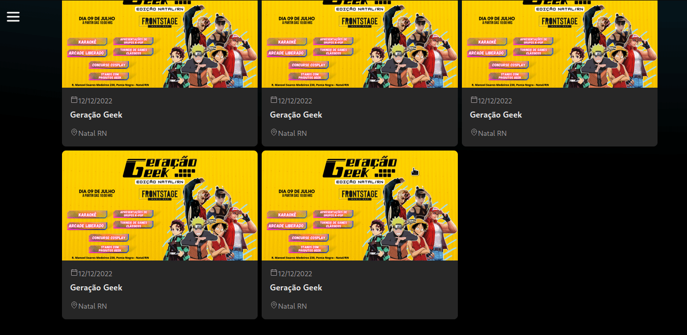

<!-- Improved compatibility of back to top link: See: https://github.com/othneildrew/Best-README-Template/pull/73 -->
<a name="readme-top"></a>

<!-- PROJECT SHIELDS -->
[![Stargazers][stars-shield]][stars-url]
[![Issues][issues-shield]][issues-url]
[![MIT License][license-shield]][license-url]

<!-- PROJECT LOGO -->
<br />
<div align="center">

<H3 align="center">EventToU</h3>

  <p align="center">
  An platform to sell, resell, buy and manage tickets to events.
  </p>
</div>

[![vercel-deploy-badge]][vercel-deploy-url]

<!-- TABLE OF CONTENTS -->
<details>
  <summary>Table of Contents</summary>
  <ol>
    <li>
      <a href="#about-the-project">About The Project</a>
      <ul>
        <li><a href="#built-with">Built With</a></li>
      </ul>
    </li>
    <li>
      <a href="#getting-started">Getting Started</a>
      <ul>
        <li><a href="#installation">Installation</a></li>
      </ul>
    </li>
    <li><a href="#usage">Usage</a></li>
    <li><a href="#license">License</a></li>
    <li><a href="#acknowledgments">Acknowledgments</a></li>
  </ol>
</details>

<!-- ABOUT THE PROJECT -->
## About The Project

This platform is intended to manage events tickets. So you will be able to sell, buy, ressel and manage all your tickets.

<p align="right">(<a href="#readme-top">back to top</a>)</p>

### Built With

* [![typescript-badge]][typescript-url]
* [![tailwindcss-badge]][tailwindcss-url]
* [![react-badge]][react-url]
* [![next-badge]][next-url]
* [![vite-badge]][vite-url]

<p align="right">(<a href="#readme-top">back to top</a>)</p>

<!-- GETTING STARTED -->
## Getting Started

To get a local copy up and running follow these simple example steps.

### Installation

1. Clone the repo
   ```sh
   git clone https://github.com/taleshrocha/eventtou-front.git
   ```
2. Install npm packages
   ```sh
   npm install
   ```

<p align="right">(<a href="#readme-top">back to top</a>)</p>

<!-- USAGE EXAMPLES -->
## Usage

Run the application in localhost with
   ```sh
   npm run dev
   ```
   
It will look something like this:



<p align="right">(<a href="#readme-top">back to top</a>)</p>

<!-- LICENSE -->
## License

Distributed under the MIT License. See `LICENSE` for more information.

<p align="right">(<a href="#readme-top">back to top</a>)</p>

<!-- ACKNOWLEDGMENTS -->
## Acknowledgments

<div align="center">
<a href="https://github.com/taleshrocha">
 
 <br />
 <sub><b>Tales Rocha</b></sub></a>

Done with ❤️ by  Tales Rocha 👋🏽 Contact me!

<p align="right">(<a href="#readme-top">back to top</a>)</p>

<!-- REFERENCES -->
[product-screenshot]: ./images/front-screen.png

[contributors-shield]: https://img.shields.io/github/contributors/taleshrocha/move-it.svg?style=for-the-badge
[contributors-url]: https://github.com/taleshrocha/move-it/graphs/contributors
[forks-shield]: https://img.shields.io/github/forks/taleshrocha/move-it.svg?style=for-the-badge
[forks-url]: https://github.com/taleshrocha/move-it/network/members
[stars-shield]: https://img.shields.io/github/stars/taleshrocha/move-it.svg?style=for-the-badge
[stars-url]: https://github.com/taleshrocha/move-it/stargazers
[issues-shield]: https://img.shields.io/github/issues/taleshrocha/move-it.svg?style=for-the-badge
[issues-url]: https://github.com/taleshrocha/move-it/issues
[license-shield]: https://img.shields.io/github/license/taleshrocha/move-it.svg?style=for-the-badge
[license-url]: https://github.com/taleshrocha/move-it/blob/master/LICENSE.txt

[linkedin-shield]: https://img.shields.io/badge/-LinkedIn-black.svg?style=for-the-badge&logo=linkedin&colorB=555
[linkedin-url]: https://linkedin.com/in/linkedin_username

[next-badge]: https://img.shields.io/badge/next.js-000000?style=for-the-badge&logo=nextdotjs&logocolor=white
[next-url]: https://nextjs.org/

[vite-badge]: https://img.shields.io/badge/vite-20232a?style=for-the-badge&logo=vite
[vite-url]: https://vitejs.dev/

[react-badge]: https://img.shields.io/badge/react-20232a?style=for-the-badge&logo=react&logocolor=61dafb
[react-url]: https://reactjs.org/

[tailwindcss-badge]: https://img.shields.io/badge/tailwind%20css-20232A?style=for-the-badge&logo=tailwindcss
[tailwindcss-url]: https://tailwindcss.com/

[typescript-badge]: https://img.shields.io/badge/typescript-20232A?style=for-the-badge&logo=typescript
[typescript-url]: https://www.typescriptlang.org/

[vercel-deploy-badge]: https://img.shields.io/badge/view%20deploy-20232a?style=for-the-badge&logo=vercel
[vercel-deploy-url]: https://img.shields.io/badge/view%20deploy-20232a?style=for-the-badge&logo=vercel
